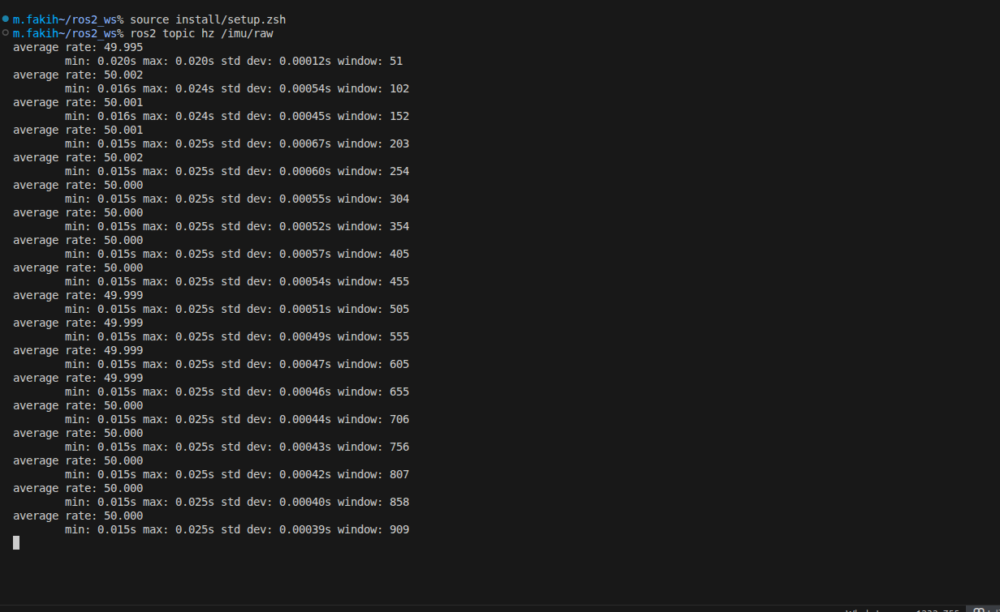
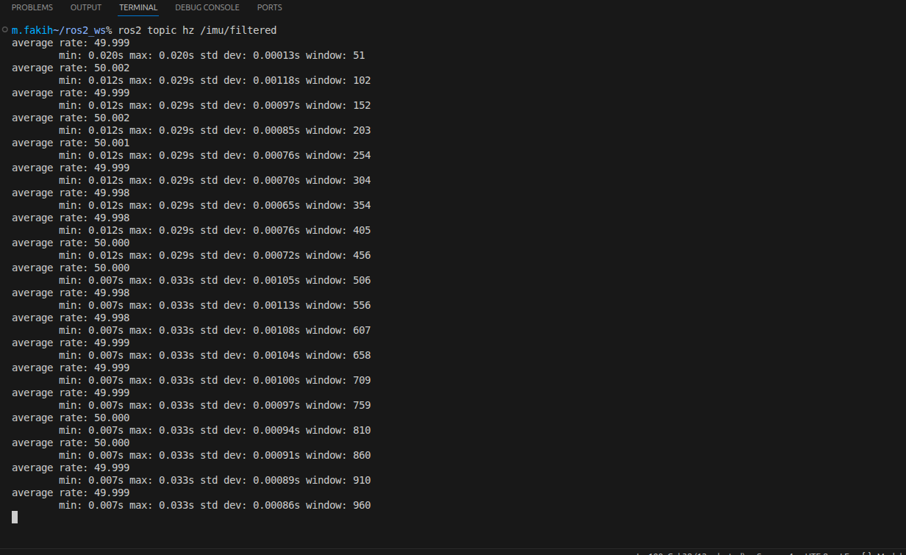
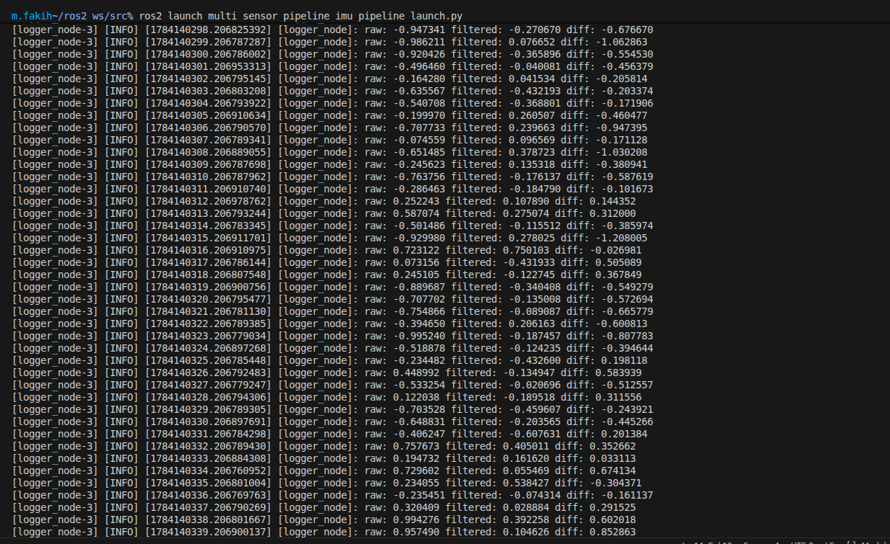
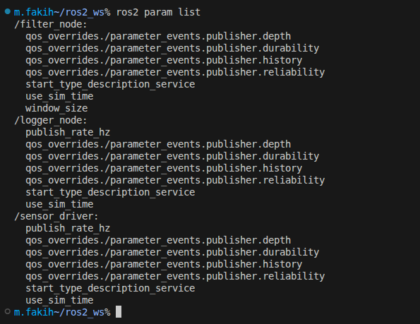
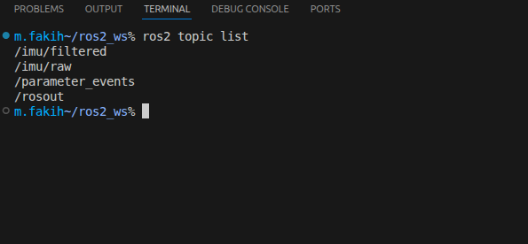

# Multi-Sensor Pipeline — ROS 2 Jazzy

A 3-node ROS 2 pipeline that simulates IMU data, smooths it with a moving-average filter, and logs the raw-vs-filtered comparison to the console.

```
sensor_driver --> /imu/raw --> filter_node --> /imu/filtered --> logger_node
                     \_______________________________________________/
                        (logger_node also subscribes to /imu/raw)
```

## Nodes

| Node | Role |
|---|---|
| `sensor_driver` | Publishes simulated `ImuReading` messages on `/imu/raw` at `publish_rate_hz` (50 Hz). Accel axes are a sinusoid, gyro axes are random noise. |
| `filter_node` | Subscribes to `/imu/raw`, applies a per-axis moving average over `window_size` samples, republishes on `/imu/filtered`. QoS: reliable, depth 20. |
| `logger_node` | Subscribes to both `/imu/raw` and `/imu/filtered`, and every 1 second (via a `WallTimer`) prints raw vs. filtered `accel_x` and their difference. |

All nodes run under the `/imu` namespace. All parameters are loaded from `config/imu_pipeline.yaml` — nothing is hardcoded in the `.cpp` files.

## Requirements

- Ubuntu 24.04
- ROS 2 Jazzy
- `colcon`

## Setup

If you don't already have a workspace:

```bash
mkdir -p ~/ros2_ws/src
```

Clone this repo into the workspace's `src` folder:

```bash
cd ~/ros2_ws/src
git clone https://github.com/maya-fakih/multi_sensor_pipeline.git
```

## Build

```bash
cd ~/ros2_ws
source /opt/ros/jazzy/setup.zsh
colcon build --packages-select multi_sensor_interfaces multi_sensor_pipeline
source install/setup.zsh
```

> Note: if you're on a shared network, set a `ROS_DOMAIN_ID` before running anything, e.g. `export ROS_DOMAIN_ID=7`.

## Run

```bash
ros2 launch multi_sensor_pipeline imu_pipeline_launch.py
```

This starts all three nodes together under the `/imu` namespace.

## Verify

In separate terminals (each sourced as above):

```bash
ros2 topic hz /imu/raw          # should show ~50 Hz
ros2 topic hz /imu/filtered     # should show ~50 Hz
ros2 param list                 # should show /imu/sensor_driver, /imu/filter_node, /imu/logger_node
```

The `logger_node` output (visible in the launch terminal) prints something like:

```
raw: 0.775212 filtered: 0.041551 diff: 0.733660
```

## Configuration

All tunable values live in `config/imu_pipeline.yaml`:

```yaml
/imu/sensor_driver:
  ros__parameters:
    publish_rate_hz: 50.0

/imu/filter_node:
  ros__parameters:
    window_size: 10

/imu/logger_node:
  ros__parameters:
    publish_rate_hz: 1.0
```

`window_size` controls how much smoothing `filter_node` applies — larger values smooth more but lag more. Change it in the YAML (no rebuild needed, just relaunch) to see the effect in the logger diff.

## Screenshots

- `ros2 topic hz /imu/raw` showing ~50 Hz  
  

- `ros2 topic hz /imu/filtered` showing ~50 Hz  
  

- Logger output showing raw vs. filtered vs. diff  
  

- `ros2 param list` showing all three namespaced nodes and their parameters  
  

- `ros2 topic list` showing all running topic  
  


## Project layout

```
multi_sensor_pipeline/
├── assets/
│   ├── topic_hz_raw.png
│   ├── topic_hz_filtered.png
│   ├── logger_output.png
│   └── param_list.png
├── config/
│   └── imu_pipeline.yaml
├── launch/
│   └── imu_pipeline_launch.py
├── src/
│   ├── sensor_driver.cpp
│   ├── filter_node.cpp
│   └── logger_node.cpp
├── CMakeLists.txt
└── package.xml
```